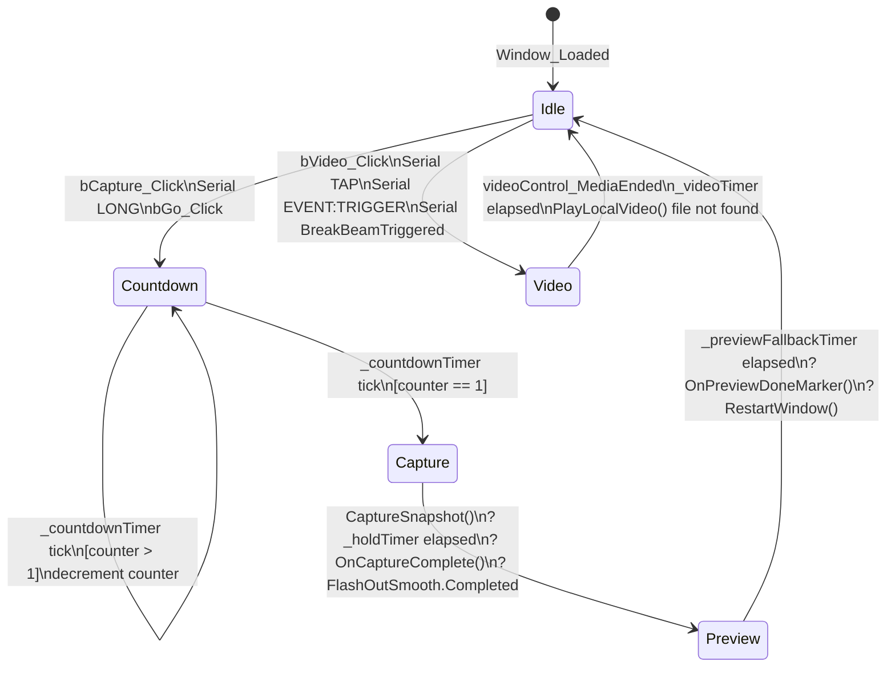
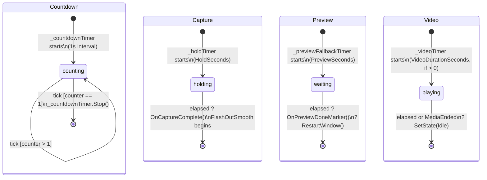
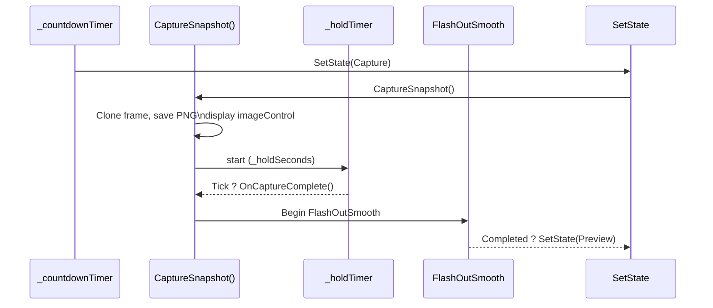

# AppState Machine

## State Descriptions

| State | Description |
|---|---|
| `Idle` | Live camera feed shown via `_previewLoop`. All UI reset. Awaiting trigger. |
| `Countdown` | `_countdownTimer` ticks every 1s, decrementing `_counter` from `CountdownSeconds` (6) down to 1. Each tick plays `CountdownNumberInOut` animation. |
| `Capture` | Single frame cloned from `_frameFull`, saved to PNG, displayed in `imageControl`. `_holdTimer` delays before flash-out. |
| `Preview` | Captured image shown with horizontal flip. `_previewFallbackTimer` counts down `_previewSeconds` before restarting. |
| `Video` | `videoControl` (MediaElement) plays `media\video.mp4`. Optional `_videoTimer` enforces `_videoDurationSeconds` cap. |

## Timer Lifecycle per State

## Flash Animation Sequence (Capture flow)

## Trigger Sources ? State Transitions

| Trigger Source | Event / Value | Resulting Transition |
|---|---|---|
| Button | `bCapture_Click` | `Idle ? Countdown` |
| Button | `bVideo_Click` | `Idle ? Video` |
| Serial | `EVENT:TRIGGER` | `Idle ? Video` |
| Serial | `DEBUG: ManualButtonEvent: TAP` | `Idle ? Video` |
| Serial | `DEBUG: ManualButtonEvent: LONG` | `Idle ? Countdown` |
| Serial | `DEBUG: BreakBeamTriggered: YES` | `Idle ? Video` |
| Internal | `_countdownTimer` reaches 1 | `Countdown ? Capture` |
| Internal | `_holdTimer` + `FlashOutSmooth` | `Capture ? Preview` |
| Internal | `_previewFallbackTimer` | `Preview ? Idle` (via RestartWindow) |
| Internal | `_videoTimer` | `Video ? Idle` |
| MediaElement | `MediaEnded` | `Video ? Idle` |

## Configuration (appsettings.json)

| Key | Default | Controls |
|---|---|---|
| `FlashInSeconds` | `1.0` | `FlashInFast` storyboard duration |
| `FlashOutSeconds` | `2.0` | `FlashOutSmooth` storyboard duration |
| `HoldSeconds` | `0.3` | `_holdTimer` interval (Capture ? flash-out delay) |
| `PreviewSeconds` | `10.0` | `_previewFallbackTimer` interval |
| `VideoDurationSeconds` | `33.0` | `_videoTimer` cap (`0` = play full file) |
