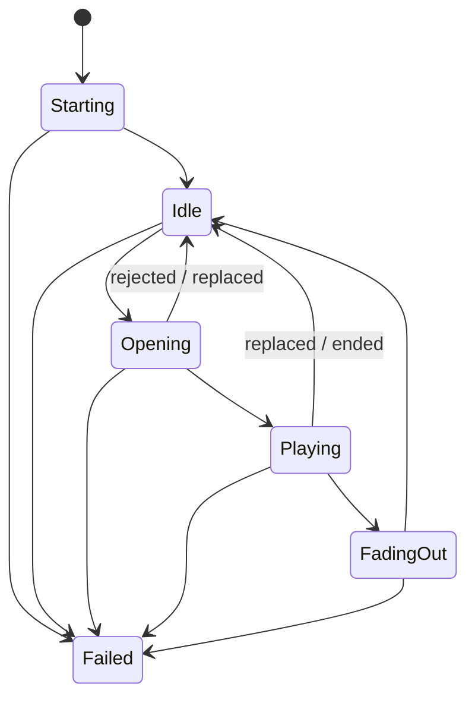

# ExperienceX maintenance guide

ExperienceX uses C# and Direct3D 11. The application namespace is `ExperienceX`. Camera and the original Experience remain separate applications. Camera and ExperienceX now share the [UDP broadcast protocol](../NETWORKING.md); older clients must add device/source/requestId to their playback bodies. Shader behavior, per-monitor playback, independent audio, and per-user configuration location are unchanged.

## Source layout and ownership

| Folder | Responsibility |
|---|---|
| Application | Startup composition, request routing, and owned asynchronous work |
| Configuration | Paths, first-run migration, defaults, validation, schema upgrades, atomic saves, and live reloads |
| Networking | UDP reception, request parsing, and retry deduplication |
| ../Shared/Networking | Shared broadcast envelope, device identity, sender/retries, listening sockets and bounded deduplication for Camera and ExperienceX |
| Windows | Monitor discovery, window lifetime, availability, and topmost behavior |
| Video | Rendering worker, GPU resources, Media Foundation session, playback timeline, counters, and recovery policy |
| Audio | Device discovery, prepared playback, channel routing, and sample-based fades/limits |
| Calibration | Editing, undo, geometry validation, overlays, labels, and save confirmations |
| Media | Shipped media files and safe media-path resolution |
| Shaders | HLSL and embedded compiled shader resources |

`ExperienceHost` wires services together and routes requests. `ConfigurationService` owns its watcher, debounce timer, polling timer, current validated snapshot, and reload task. `UdpExperienceListener` owns the socket and receive-loop cancellation. `MonitorManager` owns monitor notifications, its one-second check timer, and windows. `AudioManager` owns active audio tracks; the host owns preparation tasks. Each audio request owns a shared-mode WASAPI stream and an immutable sample-volume multiplier, so requests can overlap on the same endpoint/channel. Completion removes only that playback object; disconnect disposes every track on the affected endpoint. Video replacement remains per monitor.

## Thread and resource rules

The WPF dispatcher owns application options, routing, window operations, the active audio-track collection, and calibration edits. File I/O and audio preparation run in background tasks, returning to the dispatcher before changing application state. `AsyncTaskScope` tracks and observes asynchronous work, prevents new work during shutdown, cancels pending work, and waits up to five seconds for completion.

`AudioDeviceSelection` resolves single devices, comma lists, arrays, virtual groups and the default, deduplicating physical endpoint IDs. Multi-output requests use `CoordinatedAudioPlayback`, whose dedicated thread owns every WASAPI client, shared decoder and buffer event. Preparation is gated before a common future start; cancellation releases all prepared resources even before that gate opens. `CoordinatedAudioOutput` maps queued frames to QPC using `AudioClockMapping`; `AudioSynchronizationCursor` adjusts a continuous source cursor rather than periodically seeking. `AudioResampler` uses polyphase windowed-sinc interpolation. `SharedAudioSource` keeps bounded history sized for downstream latency differences and decodes once per request. Options and inventory snapshots cross threads through volatile references. Device removal affects only that endpoint. Group disposal cancels, wakes and joins its worker before releasing handles; a timed-out worker retains ownership until it exits. Endpoint timing estimates exclude unreported speaker processing and acoustic travel time.

Each `VideoRenderer` has one dedicated render worker. `GraphicsResources`, `MediaEngineSession`, `CalibrationOverlay`, `PlaybackMetrics`, the transform cache, and the playback timeline belong to that worker. Media callbacks publish flags and wake the worker; they do not draw or manipulate windows. Cross-thread renderer requests use the bounded, coalescing mailbox. All GPU and media disposal remains on the worker, including failure paths. Debug builds check the graphics-resource owner thread.

Use immutable option snapshots when passing configuration to the worker. Do not mutate their dictionary contents after publication. Shader constant structures must continue to match the HLSL packing and GPU readback checks.

## State and timing

`RendererStateMachine` validates transitions:



A failed worker is recreated; it does not transition back into playback. Recovery returns to idle with the configured monitor background. `VideoPlaybackTimeline` starts only after an advancing frame has been submitted at zero opacity, and computes fades against the earlier natural or maximum deadline. Completion submits and commits a frame with transparent video over the configured background before closing the media session. `PlaybackMetrics` records the same event fields independently of scheduling.

## Configuration evolution

The live file is `%LOCALAPPDATA%\Home Technologies\ExperienceX\Configuration\appsettings.json`. `LocalConfiguration` resolves the current user's known folder and performs first-run migration. It does not monitor OneDrive. Builds ship templates and never replace the live local file.

`ExperienceOptions` is the source of defaults and validation. `ConfigurationSchema` owns JSON parsing policy and ordered schema migrations. Unversioned configuration is version 0; version 1 preserves legacy names, adds their current equivalents when absent, and retains unknown fields. Version 2 converts legacy monitor background strings to separate `BackgroundColor` and `IsTransparent` fields. Detected monitors lacking settings receive persisted black/opaque defaults. `KeystoneConfigurationStore` persists migration/default additions and targeted transparency toggles atomically, preserving unrelated fields and retaining the preceding file as `.bak`. Unsupported future versions are rejected without downgrade or overwrite.

For a new setting, add its default and validation to the options model, determine whether it applies live, and update the README. For a structural change, add an explicit schema migration and tests for old files, new files, unknown fields, and rejection of newer unsupported versions. Preserve external-editor locking and the accepted-settings/render-confirmation ordering.

## Shutdown

Closing a production window first requests application shutdown without immediately destroying its HWND. The app awaits the host while the dispatcher continues pumping. The host stops UDP/configuration producers, drains calibration and preparation work, closes audio, then asks all windows to stop recovery and render workers. Worker disposal is bounded and never moves GPU cleanup onto the UI thread. The single-instance mutex and telemetry remain alive until this sequence completes.

## Verification and formatting

Tests use a `ProjectReference` to the actual application and `InternalsVisibleTo`; do not link copies of production `.cs` files into the test assembly. Fast checks live in `ExperienceX.Tests/Unit`; GPU and native-window checks live in `ExperienceX.Tests/Hardware`. The runner returns a nonzero exit code on failure and uses no extra test framework dependency.

```powershell
# Fast checks: no GPU or audio-device initialization.
dotnet run --project ExperienceX.Tests/ExperienceX.Tests.csproj
# GPU readback, device loss/recovery and window tests only.
dotnet run --project ExperienceX.Tests/ExperienceX.Tests.csproj -- --hardware
# All checks.
dotnet run --project ExperienceX.Tests/ExperienceX.Tests.csproj -- --all
```

Stop the applications before any build, including an implicit build from `dotnet run`. Build copying can be disabled with `-p:CopyBuildOutputToOneDrive=false` for verification. Project-referenced test builds disable deployment of the referenced app. Live scripts additionally verify real monitors/audio devices and restore the local configuration; they are separate from the fast suite.

Each project has an `.editorconfig`. Format from its directory with `dotnet format whitespace . --folder --exclude bin obj`. Append `--verify-no-changes` for a formatting check. Compiled shaders stay checked in; use `Compile-Shaders.ps1` when HLSL changes.
